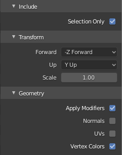

# Scan 3D

## Setup

- Download and install [Node.js](https://nodejs.org/en/download/)
- Download and install [Git LFS](https://git-lfs.github.com/)

``` bash
# Fetch and update LFS files
git lfs fetch
git lfs update

# Install dependencies (only for first time)
npm i

# Serve at localhost:8080
npm run dev

# Build for production in the dist/ directory
npm run build
```

## Generate data

### Photos

- Take photos with great natural light
- Don't shake
- Lock focus and brightness to a setting without to much saturation
- If objects are far (few meters) walk 3 to 4 steps between photos
- If objects are close (less than 2 meters) walk a maximum of 2 steps between photos
- Keep the the angle slightly above the horizon
- Try not to have the sun in front of you

### 3DF Zephyr Aerials

#### Import and generate

- Open 3DF Zephyr Aerials
- Drag and drop the photo sequence
- Use those settings<br>
- Run and wait (it can take from few minutes to few hours depending on the quality and quantity of the photos)

#### Export

- Export as OBJ<br>
- Use those settings<br>

### Blender

#### Geometry

- Import the OBJ in Blender with default settings
- Merge vertices by distance
- Rotate the scene (Z positive = up, Y positive = forward)
- Fix incorrect areas (floor, ceiling, reflections)
- Create a man reference (can be a simple box 180cm high) and scale the model accordingly
- Run `/resources/blender/textureToVertexColor/textureToVertexColors.py` to convert texture to vertex color (you might need to change the image name in the last line of the script)
- Export as PLY
- Use those settings<br>
- Optimize the PLY using the python script `/resources/python/optimise.py`

```
# Default
python3 optimise.py --path ./example.ply

# Change float precision (default: 9)
python3 optimise.py --path ./example.ply --precision 5

# Remove some points (default: 1)
python3 optimise.py --path ./example.ply --reduce 0.5

# Add points limit usually for testing (default: 1000000000)
python3 optimise.py --path ./example.ply --limit 300
```

#### Collision primitive

- Create collision JSON using primitives (box, circle, sphere)
- Resize, move and rotate the primitives but do not change the vertices directly and do not apply transformations
- Export using the script `/resources/blender/primitiveJsonExporter/main.py`
- Use those settings<br>

#### Floor

- Create à geometry roughly following the floor
- Export as PLY
- Use those settings<br>
